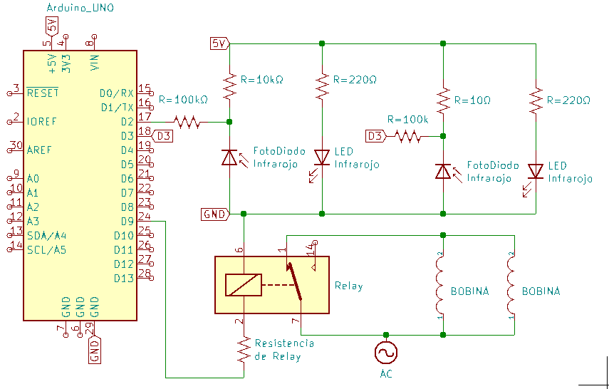

***ACELERADOR ELECTROMAGNÉTICO DE MACRO-PARTICULAS***

*OBJETIVO*  
Mostrar el funcionamiento de un acelerador de particulas electromagnético, con los principios teóricos que conllevan su funcionamiento y a su vez la adquisición de conocimientos sobre electrónica y aplicaciones de las tecnologías. En base a un modelo sencillo y visualizable. Se ha optado por un acelerador pequeño de 10cm de radio.

**Diseño**  
Las partes que conforman a este proyecto son
- El riel 
- La bobina
- El sensor 
- Una placa de control
- Arduino -Uno-

1. El riel: Canal circular de 10cm de radio para contener a la partícula por un camino circular. 
Este riel se diseño en OpenSCAD e imprimió en 3D. 
    Se compone de cuatro partes que ocupan un cuarto del riel, dos de ellas se las imprimió con un riel sin módificaciones. La otras dos, son 
el riel2sensor con unas pequeñas muecas para acomodar un sensor. La otra, se trata de un riel al cual se le agregaron 2 pares de acoples para leds, los cuales hacen de sensores. 

2. La bobina: Equipo que contiene alambre de cobre galvanizado para entregar la energía cinética a la partícula. 
Diseñada en OpenSCAD e impresa en 3D. Tiene una resistencia total de 2 ohms, 4 solenoides en paralelo con un total de vueltas no determinado. 
Material para la bobina: 
    - Cobre esmaltado cant: Indeterminado
    - Diodo en paralelo

3. El sensor: Equipo electrónico que detectará el paso de la partícula a través del riel, dará la instrucción para el encendido de la bobina.
Diseñado en papel y armado con material electrónico. 
Material para el sensor: 

    - LED infrarojo especificaciones: 5mm de diametro
    - LED foto-receptor especificaciones: 5mm de diametro
    - Placa protoboar
    - Resistencias de 220, 10k y 100k

Esquema del circuito: 

4. Arduino y fuente: Equipo electrónico que al recibir la señal del sensor otorgará suficiente corriente a la bobina para su funcionamiento. 

Material para el control: 
    - Fuente 220V
    - Relé para el paso de corriente
    - Arduino UNO 

Herramientas: Arduino, fuente de laboratorio

